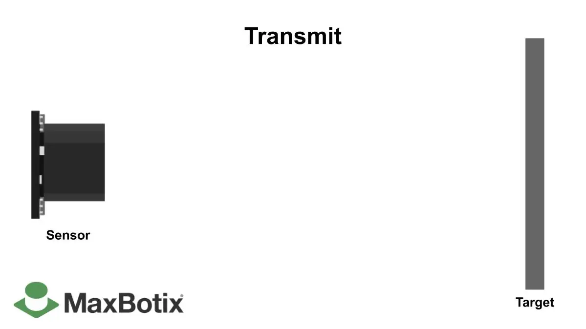
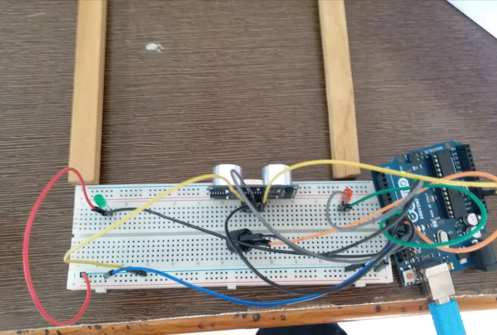

<h1 align="center">SQUID GAME</h1>
<p align="center">Red Light Green Light IoT Project</p>


<p align="center">
  <em>Innovating with IoT: A seamless fusion of IoT technology and a thrilling game.</em>
  <br>
  <em>Recreation of the suspenseful Red Light Green Light game from Squid Game.</em>
</p>

---

## Introduction

Welcome to the Red Light Green Light IoT Project, a groundbreaking fusion of technology and nostalgia. I have brought to life the heart-pounding game from the Korean sensational web series, Squid Game. Just like in the show, participants must freeze on a "red light" to survive. Caught moving during this phase? You're out. But when the "green light" flashes, the race to the finish line begins.


This is an adventure where the worlds of technology, education, and entertainment collide. The project employs an Arduino UNO, LEDs, an Ultrasonic Sensor, and an Electronic Buzzer to recreate the excitement and challenges of the original game.


---

## Project Idea

The inspiration for this project stems from the captivating moments in Squid Game. I aimed to bring the game's thrill and educational value to life, showcasing how technology can enhance learning and entertainment simultaneously.

## Components Used

- Arduino UNO R3
- LEDs
- Ultrasonic Sensor HC-SR04
- Electronic Buzzer

## Folder Structure

The project repository is structured as follows:

- `main.ino`: The main Arduino sketch file.
- `images/`: A folder containing images used in this README.

## Requirements

Before you begin, ensure you have the following:

- An Arduino UNO board
- Appropriate cables for connecting the components
- Arduino IDE installed on your computer

## How It Works

- **Ultrasonic Sensor:** It works by emitting high-frequency sound waves that bounce off objects in its path. By measuring the time it takes for the sound waves to return, the sensor calculates the distance to the object.



- **LED Control:** The LEDs act as the game's traffic lights, signaling 🟢green and 🔴red lights as participants race against time. The Arduino skillfully coordinates this dramatic display in accordance with the game's rules.

- **Player Interaction:** Participants fully immerse themselves in the game, navigating within a predefined distance of the Ultrasonic sensor. The LEDs respond to their movements, recreating the suspense and excitement of the original game. If a player is caught moving during a "red light," the buzzer sounds, and they are out.

---

## Setup

1. Clone this repository to your local machine:

   ```bash
   git clone https://github.com/viren711/squid-game.git

2. Make connections of components as shown in the image:
   <br>
   
   <br>
   

This project stands as a testament to the incredible potential of merging technology with education and entertainment. It showcases the limitless possibilities of technology-driven experiences. We're excited to continue pushing the boundaries, exploring new features, and enhancing the game's experience for all.

<div align="center">
  "Technology allows us to push the boundaries of what's possible and redefine the way we learn and have fun."
</div>
---

[](https://www.youtube.com/watch?v=sH4Y450PSVM)
-
<h6 align=left>Click on SQUID GAME to see the video</h6>
---
